# ConsoleTetris
这是一个基于Windows控制台的俄罗斯方块游戏。

它除了提供基本俄罗斯方块游戏以外，还有双人模式、隐形模式、道具系统、键位设置、界面宽度设置等功能。

这是我的早期作品之一，编写于2016年6月，完成于2016年10月。

# 用户手册

## 主界面说明

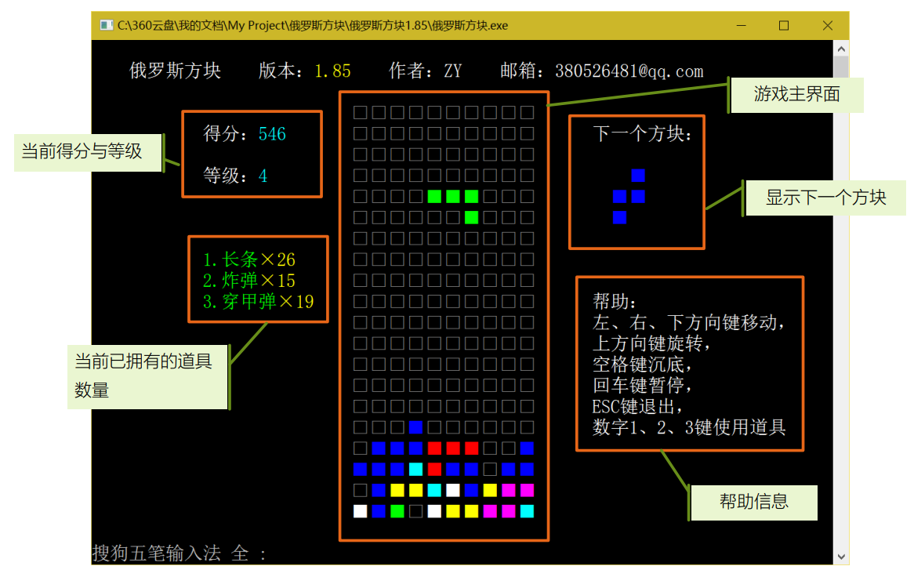

## 按键说明

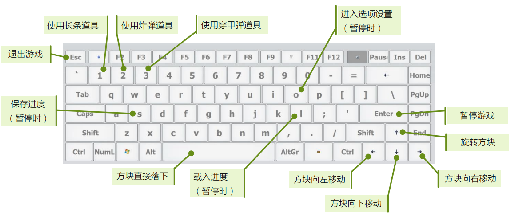

## 得分与等级

在本游戏中，消除任意行数可以增加游戏得分。消除的行数和得分的关系如下表所示： 

| 消除的行数 | 增加的得分 |
| ---------- | ---------- |
| 1          | 1          |
| 2          | 3          |
| 3          | 5          |
| 4          | 8          |

当得分增加到一定值的时候，会使得等级提升（选项设置中可以指定提升 1 个等级所需要的得分，详 见下面“选项设置”小节），如果选项设置中设置为允许升级的话。 

在本游戏中，等级会决定方块下落的速度，等级为 1 级时方块下落的速度 最慢，等级越高，方块下落的速度就越快。当等级达到 9 级时，方块下落的速 度已经达到最快，此时等级再提升将不会改变方块下落的速度。

## 游戏结束

当新的方块在界面的最上方生成的时候，如果它所在的位置已经被原有的 方块占据，则被判定为游戏结束。游戏结束时会显示如下界面：

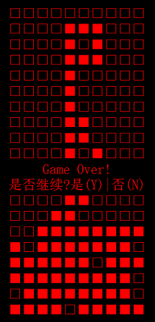

此时按Y键将重新开始游戏，按N键退出程序。

## 游戏暂停

在游戏过程中按下回车键将进入暂停状态，如右图所示。此时，可以按下S、L和O键实现保存进度、载入进度和选项设置功能。

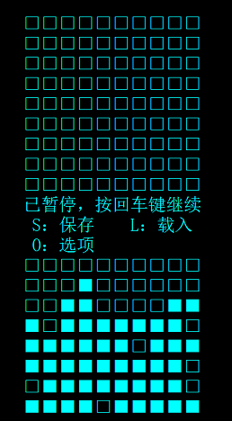

处于暂停状态时，按回车键或ESC键将返回游戏。

## 保存与载入进度

游戏提供了保存和载入数据的功能。要进行保存或载入进度，先按回车键进入暂停状态，如上图所示。

### 保存进度

在暂停状态下，按下键盘上的S键后，界面显示“已保存”，此时，游戏的进度、得分和各种选项设置将会被保存到游戏主程序所在目录下面名为“GameData.dat”的文件里。如果不存在此文件，则此文件会被自动创建。

### 载入进度

在暂停状态下，按下键盘上的L键将载入游戏主程序所在目录下“GameData.dat”文件中的游戏数据。载入后游戏界面显示“已载入”。
在执行了保存或载入操作后按回车键或ESC键返回游戏。

## 选项设置

要进入选项设置，在游戏过程中按回车键进入暂停状态，此时下键盘上的O键将进入选项设置。
选项设置界面如下图所示：

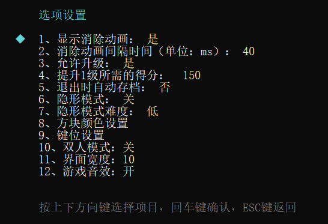

在选项设置界面按上下方向键可以切换选中的项目。其中当选中的项目为第2项或第4时，按下回车键或右方向键后将出现一个闪烁的光标：

此时需要从键盘输入一个数字来设置对应选项的数值，输入之后按回车键。

注：当出现闪烁光标时，必须从键盘输入一个数字，此时按ESC键不能返回。
当选中的项目为第1、3、5、6、7项时，按回车键或右方向键可以依次在可以设置的选项中切换。

### 显示消除动画

将此选项设置为“是”时，如果游戏中出现了可消除的行，将会提供一个逐个格子消除的动画效果。将此选项设置为“否”时，如果出现可消除的行，则该行直接消失。

### 消除动画间隔时间

此选项用来设置消除动画效果的快慢。这个选项的设置值代表了消除一行时，消除第一个格子所花的时间，此数值设置的越大，消除动画的速度就越慢，反之则越快。它的可允许设定值为5~9999毫秒之间。它的默认值是40毫秒。

### 允许升级

此选项用来设置是否允许升级。
将此选项设置为“是”时，增加得分会使得等级提升；如果将此选项设置为“否”，则等级将一直是1级，不会提升。同时，主界面中的等级信息将不显示。
注：如果等级已经超过1级了，将此选项从“是”更改为“否”的话，等级会直接变为1级，将此选项更改为“是”后恢复原来的等级。

### 提升1级所需的得分

此选项用来设置等级每提升1级所需的得分。
此选项的值设置得越大，等级的提升就越困难，同时，方块下落速度的提升也会变得越慢，获得更高的得分也会变得越容易；
此选项的值设置得越小，等级的提升就越容易，但是方块下落速度的提升就会越快，获得更高的得分将变得越困难。
此选项的设定值不允许小于1。
注：本游戏中等级的计算方法为：等级 = 得分/提升1级所需的得分 + 1。

### 退出时自动存档

将此选项设置为“是”时，按ESC键退出游戏前会自动执行一次保存操作。
注：鼠标点击游戏窗口右上角的关闭按钮退出游戏将不会自动保存。

### 隐形模式

将此选项设置为“是”时游戏将进入隐形模式，将此选项设置为“否”时将退出隐形模式。详细内容参见下面“隐形模式”小节。

### 隐形模式难度

此选项用于设置隐形模式下游戏的难度，有“低”、“中”、“高”三种难度可选。详细内容参见下面“隐形模式”小节。

### 方块颜色设置

选择此选项将进入方块颜色设置的二级菜单，如图所示：

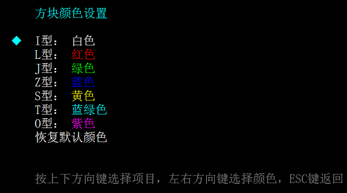

此选项可以自由定义7种俄罗斯方块的颜色，总共有白色、红色、绿色、蓝色、黄色、蓝绿色、紫色和灰色8种颜色可选。
在方块颜色设置中，按上下方块切换选中的项目，按左右方向键可以切换选中项目的颜色。选择最后一项“恢复默认颜色”时，按回车键或右方向键可以恢复成默认的颜色。
按ESC键将返回上一级菜单。
注：更改了方块颜色设置时，当前方块和下一个方块的颜色都不会改变，从下下一个方块开始，方块的颜色才会变为设置的颜色。

### 键位设置

选择此选项将进入键位设置二级菜单，如图所示：

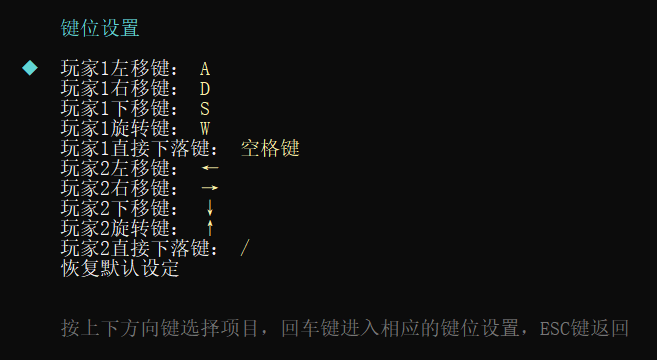

使用上下方向键选择对应的项，按下回车键设之后，按下要设置的键设置键位。

### 双人模式

将此选项设置为“是”时，将开启双人模式，可允许两名玩家同时游戏。关于双人模式的说明请参照下面的“双人模式”章节。

### 界面宽度

此选项可以设置界面的宽度。选中此选项后按下回车键，输入要设置的界面宽度，按下回车键即可。界面宽度可允许设置的范围为10~20。

如果新的界面大于原来的界面宽度，则界面会向右侧扩展。

如果新的界面小于原来的宽度，则界面右侧多余的列会被隐藏。

注意：如果更改界面宽度后出现了可消除的行，则这些行会被立刻消除，同时界面右侧不可见的列将保持不变。

### 游戏音效

开启此选项后，在方块移动、旋转、下落，以及消除行时会有相应的音效。

## 道具系统

本游戏中提供的道具共有3种：长条、炸弹和穿甲弹。获得道具后会在界面左侧显示出来，如下图所示：

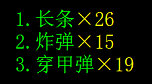

### 道具的获得

在游戏中，每消除任意行数会有一定的概率随机获得一个道具，消除的行数和获得道具的概率的对应关系如下表所示：

| 消除的行数 | 获得一个道具概率 |
| ---------- | ---------------- |
| 1          | 10%              |
| 2          | 25%              |
| 3          | 50%              |
| 4          | 100%             |

### 道具的使用

按下键盘上的数字1、2、3键分别使用长条、炸弹和穿甲弹道具。使用后，下一个方块将变成使用的道具（当前方块并不会变化）。如下图所示：（注：如果下一个方块已经是要使用的道具，则不会使用道具，相应道具的数量不会减少。）

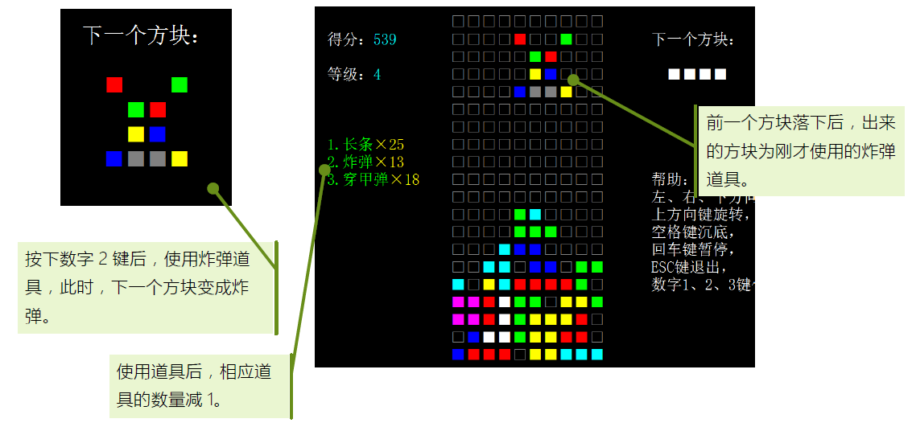

### 炸弹道具

炸弹道具将会消除它所在下方的一个4x4的区域。如下图所示：

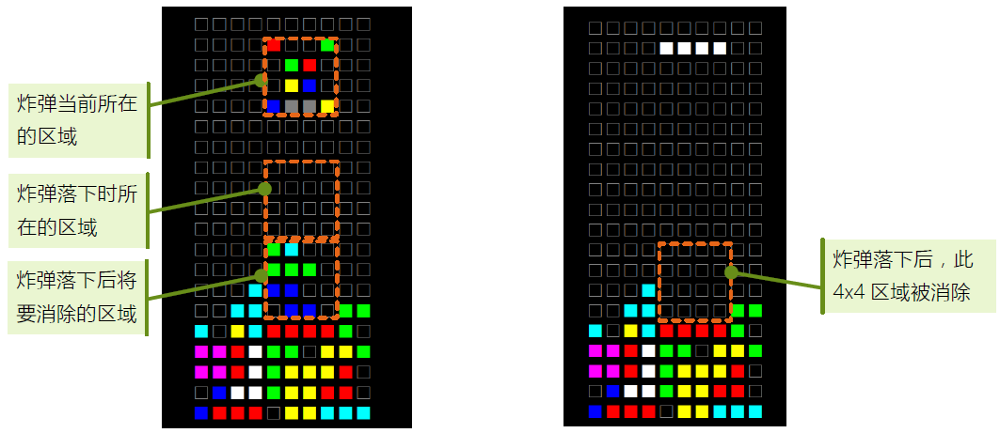

### 穿甲弹道具

穿甲弹道具将无视遮挡，下落到它所在列的最下方的一个空的格子中并将其填充。
如下图所示：

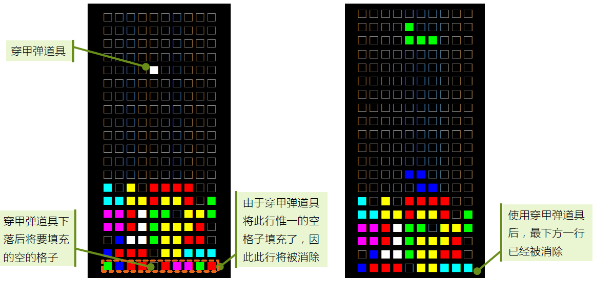

## 隐形模式

隐形模式为本游戏中难度较大的模式，在隐形模式下，下方的方块将不可见，玩家只能通过记忆来判断方块应该下落的位置。

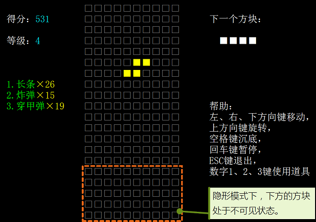

但是在不同的难度下，下方方块可以在特定的时候显示一段时间。
要进入隐形模式，请在选项设置中将“隐形模式”一项设置为“开”。选项设置的详细操作方法请参见上面“选项设置”小节。
隐形模式共有3种不同的难度模式可供选择，分别为“低”、“中”、“高”。在选项设置中可以设置隐形模式的难度。如下图所示。选项设置的操作方法请参见上面“选项设置”小节。

### 低难度模式

选项设置中将“隐形模式难度”设置为“低”时即为此模式。在此模式下，方块每次下落的瞬间都会显示一次下方的方块，时间持续500毫秒。如图下所示：

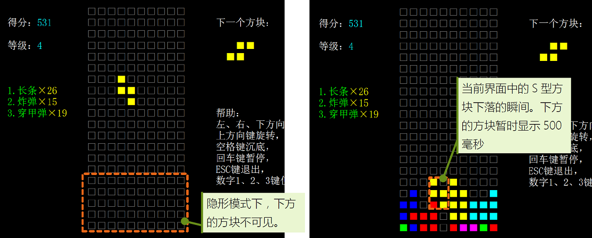

注：如果选项设置中开启了“显示消除动画”，则当有消除行时，显示消除动画将获得更长的显示下方方块的时间。

### 中难度模式

选项设置中将“隐形模式难度”设置为“中”时即为此模式。在此模式下，只有在有消除行时才显示下方方块，在消除动画前会有500毫秒的停顿时间。

### 高难度模式

选项设置中将“隐形模式难度”设置为“高”时即为此模式。在此模式下，任何时候都不会显示下方方块，直到游戏结束为止。在此模式下，如果选项设置中将“显示消除动画”设置为“是”，则在有消除行时会显示当前消除的行，并显示消除动画，如下图所示。

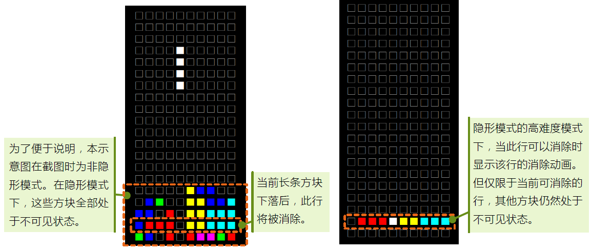

## 双人模式

开启双人模式后允许两名玩家同时游戏。如下图所示：

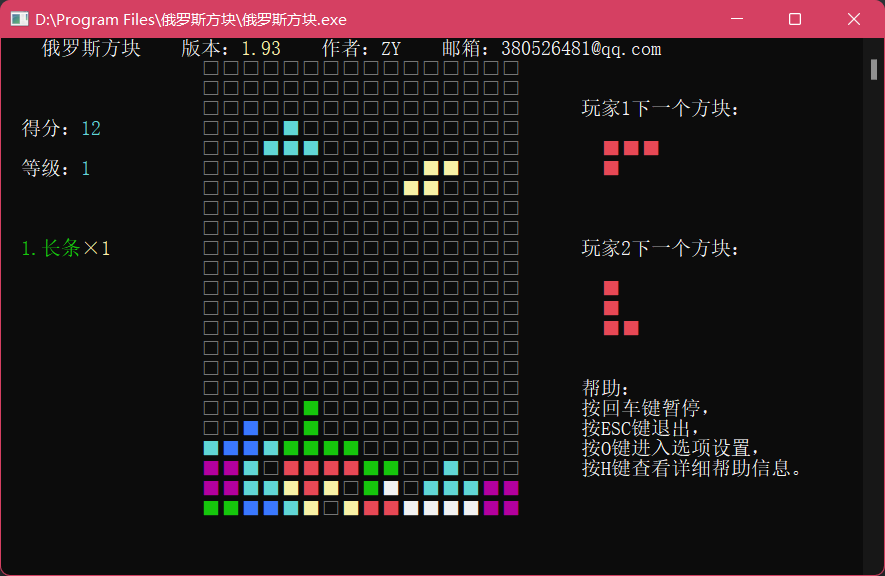

在此模式下，两名玩家将分别控制一个方块。方块在落地前互不干扰。

